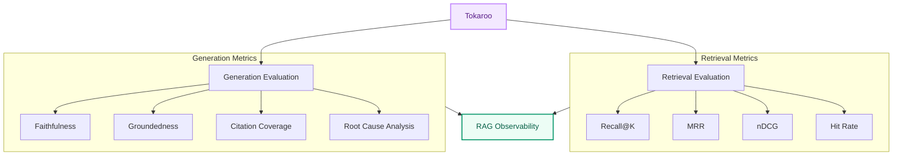

# Tokaroo : The Adaptive RAG Evaluator & Optimizer

<p align="center">
  
</p>

[](https://www.python.org/)
[](https://fastapi.tiangolo.com/)
[](https://docs.pytest.org/)
[](LICENSE.md)
[](#)
[](#)

Tokaroo (Token+Kangaroo) is an advanced, lightweight AI evaluation engineering toolkit designed to diagnose, explain, and automatically heal Retrieval-Augmented Generation (RAG) pipelines.

---

## 1. What is Tokaroo?

Tokaroo acts as an **X-Ray for your prompt context**, simulating how text chunks are semantically embedded, cross-encoded, positioned, and ultimately processed by LLMs. It features an interactive **Cinematic 3D Semantic Network UI** and an asynchronous benchmarking pipeline to visualize and stress-test your retrieval strategies in real-time.

---

## 2. Why Tokaroo?

Most RAG systems tell you **WHAT** answer was generated. **Tokaroo tells you WHY it happened.**

* Did retrieval fail?
* Did context get lost in the middle?
* Did reranking help, or did it just introduce latency?
* Did the model hallucinate?

<p align="center">
  
</p>

### The RAG Mental Model
* **Traditional RAG Tools** = *Logs*
* **Tokaroo** = *X-Ray + Profiler + Debugger*

If LangSmith helps monitor production, **Tokaroo helps you understand *why* retrieval and generation fail** during prototyping and optimization.

### Learning Journey
Tokaroo was built as a learning-first AI engineering project. The goal was not to build another chatbot wrapper, but to deeply understand and diagnose:
* **Why retrieval fails** (and how hybrid search/reranking fixes it)
* **Why rerankers help** (and when they introduce too much latency)
* **Why relevant chunks get ignored** (lost-in-the-middle context decay)
* **Why hallucinations occur** (context mismatch and semantic drift)
* **How to evaluate RAG systems scientifically** (using robust mathematical metrics)

---

## 3. Architecture Diagram

Tokaroo operates across **four distinct conceptual layers**:



### How It Works Under the Hood
1. **Text → Tokenization**: Measures target footprints using model tokenizers (e.g., `cl100k_base`, `llama_sentencepiece`).
2. **Chunking Simulation**: Emulates naive chunking, enforcing safety math (preventing pathological overlaps > 50%).
3. **Hybrid Information Retrieval**:
   * **Semantic Search:** Uses `SentenceTransformers` (`all-MiniLM-L6-v2`) for raw dense embedding generation.
   * **Lexical Overlap:** Computes keyword density to ensure semantic matches aren't "hallucinated relevance".
4. **Strict Pre-Prompt Filtering**: Dynamically filters chunks based on adaptive thresholds (e.g., `max(0.2, max_score * 0.6)`) to aggressively discard noise before it hits the model.
5. **Optional Cross-Encoder Reranking**: When `reranker_enabled=true`, uses `ms-marco-MiniLM-L-6-v2` as an elite signal truth to re-evaluate semantic relevance against the query.
6. **Attention Model & Usage Simulation**: Calculates deterministic positional weights to simulate U-shaped LLM attention curves.
7. **Diagnostic Analyzer**: A strict, hierarchical decision tree identifies primary structural flaws (e.g., Overflow > No Relevant Context > Redundancy).
8. **Adaptive Optimizer Loop (2-Pass Mode)**: If `auto_optimize=True` and the `health_score` is poor, Tokaroo automatically applies its recommended config and re-runs the simulation to "heal" the RAG query.
9. **Cinematic 3D UI Engine**: A React and Three.js-based rendering engine visualizes chunk relevance (nodes), relationships (edges), and failure states (red bursts + camera shake) in real-time.

---

## 4. Key Features

### Who is Tokaroo for?
* **Academicians & Researchers:** Study and visualize positional bias and attention decay dynamically.
* **Students:** Understand the intersection of Vector Search, Reranking, and LLM Prompt Construction without paying thousands in API fees.
* **IT Developers / AI Engineers:** Audit chunking heuristics, reduce token padding overlap, and automatically optimize runtime parameters for production pipelines.

### Feature Matrix

#### Retrieval Engineering
* Chunking + overlap analysis
* Dense, BM25-like keyword, and hybrid retrieval
* Multi-query and HyDE query transforms
* Cross-encoder reranking & RRF fusion

#### Context Engineering
* Retrieval/usage gap and attention waste analysis
* Lost chunk analysis
* U-shaped attention curve simulation
* Strict pre-prompt filtering

#### Generation Layer
* Synthetic answer generation
* LLM-based generation simulations
* Faithfulness analysis & Groundedness verification
* Citation coverage evaluation

#### Observability & Diagnostics
* **Priority Diagnosis Tree**: Resolves overlapping failures using a strict hierarchy:
  1. `context_window_overflow`
  2. `no_relevant_context`
  3. `high_token_redundancy`
  4. `over_chunking`
  5. `semantic_fragmentation`
  6. `lost_in_middle_decay`
  7. `noisy_context_usage`
  8. `semantic_mismatch`
  9. `false_positive_retrieval`
  10. `weak_query_match`
  11. `low_diversity_retrieval`
* **Root Cause Analyzer**: Computes confidence scores for Retrieval, Context, and Generation failure modes.

### Supported LLM Profiles
* **Claude 3.5 Sonnet (`claude-sonnet-4-6`)**: 1M Window
* **GPT-4o (`gpt-4o`)**: 128k Window, `o200k_base`
* **Gemini 1.5 Pro (`gemini-3.1-pro`)**: 1M Window
* **Llama 3 8B (`llama-3-8b-instruct`)**: 8k Window

---

## 5. Research Inspirations

Tokaroo's core features are deeply influenced by foundational AI research:

* **Lost in the Middle (Liu et al.)**: Inspired Tokaroo's context placement experiments and positional attention decay curves.
* **RAGAS**: Inspired metrics for retrieval quality, semantic support, and answer quality evaluation.
* **ARES**: Inspired automated RAG diagnostics and causal failure attribution.
* **Attention Is All You Need**: Inspired attention-aware context engineering.
* **Anthropic Context Engineering Guide**: Inspired token budgeting and context organization experiments.

---

## 6. Example Findings

Tokaroo helps surface actionable insights that simple vector search hides:

* **Positional Bias (Lost-in-the-Middle)**: Answer quality dropped significantly when relevant evidence was moved from the beginning to the middle of the context window.
* **Token Budgeting Overhead**: Token budgeting experiments showed that aggressive pruning improves quality-per-token but reduces coverage.
* **Reranking Overhead Tradeoffs**: Cross-encoder reranking improved faithfulness in some cases but introduced additional latency and context loss in others.

---

## 7. Quick Start

### Backend Installation & Startup
From the project root:

```powershell
cd backend
# Create and activate venv
python -m venv venv
.\venv\Scripts\Activate.ps1

pip install -r requirements.txt
uvicorn app:app --reload --port 8000
```

### Try the Adaptive Simulator
Try the adaptive simulator with a sample `curl` request:

```bash
curl -X POST "http://127.0.0.1:8000/simulate-rag" \
     -H "Content-Type: application/json" \
     -d '{
           "text": "Your long source text...",
           "query": "Specific question about text",
           "model": "gpt-4o",
           "chunk_size": 25,
           "overlap": 24,
           "top_k": 5,
           "auto_optimize": true
         }'
```
*Because `overlap` is pathologically high (24 on a 25 size), Tokaroo will detect `high_token_redundancy`, correct the overlap, recalculate the chunking, and output the optimized RAG layout.*

### Try the Asynchronous Benchmark Endpoint
```bash
curl -X POST "http://127.0.0.1:8000/benchmark-async" \
     -H "Content-Type: application/json" \
     -d '{
           "queries": ["What is Tokaroo?", "Explain adaptive overlap", "Diagnostic tree details"],
           "text": "Your long source text...",
           "model": "gpt-4o",
           "chunk_size": 25,
           "overlap": 5
         }'
```

### Frontend Cinematic Visualizer
A complete React + Three.js visualizer is included in `/frontend` to plot your `attention_curve` and highlight node relationships in real-time.

To launch the Cinematic Semantic Network Engine:
```bash
cd frontend
npm install
npm run dev
```

---

## 8. Benchmarks

Tokaroo includes a benchmark suite for controlled failure modes. Each case is designed to force disagreement between dense and lexical retrieval so RRF behavior is measurable.

To run the benchmark suite:
```bash
pytest backend/tests/test_app.py -k benchmark_suite
```

---

## 9. Documentation

### What to look for in the JSON payload
* `optimization.issues` — List of structural/contextual problems found.
* `optimization.health_score` — 0–100 index of cognitive pipeline safety.
* `optimization.recommended_config` — Suggested chunk size, overlap, and `top_k`.
* `optimization.attention_curve` — Positional weights across retrieved chunks.
* `optimization.reorder_effect` — Before/after comparison showing if reordering improves quality.
* `retrieval_debug` — Rank-level observability details (dense rank, keyword rank, RRF score).

### Testing
* Run all backend tests from the `backend` folder:
  ```bash
  pytest -q
  ```

---

## Author
AdityaP700

## License
MIT
