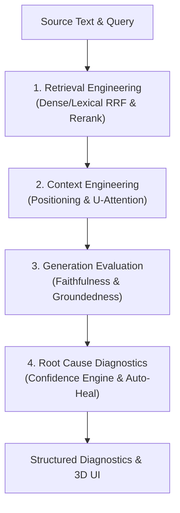

# 01. Overview
<script src="https://cdn.jsdelivr.net/npm/mermaid/dist/mermaid.min.js"></script>
<script>mermaid.initialize({startOnLoad:true});</script>

Tokaroo is a diagnostic and optimization framework for Retrieval-Augmented Generation (RAG) pipelines. It transitions developers from a trial-and-error approach to a systematic, observation-backed methodology for configuring RAG parameters.

---

## 1. What Problem?
Most developers tune RAG systems by guessing parameters (e.g., chunk size, overlap, `top_k`, reranking models) and judging output qualitatively. When a RAG pipeline fails, it is hard to isolate:
* **Was the correct information never retrieved?** (Retrieval Failure)
* **Was the information retrieved but lost in prompt formatting or truncated?** (Context Failure)
* **Did the model receive the correct context but fail to answer accurately?** (Generation Failure)

Tokaroo solves this by treating prompt context as a measurable operating system memory space, tracing and scoring how tokens travel through the system.

---

## 2. What Metric?
* **Health Score (0-100)**: A unified index indicating the structural and cognitive safety of the prompt context.
* **Failure Confidence Scores**: Relative confidence probabilities mapping the likelihood of Retrieval, Context, or Generation being the primary root cause.
* **Utilization Score**: Ratio of context tokens actively attended to by the model compared to total context tokens.

---

## 3. How Implemented?
Tokaroo simulates the lifecycle of a RAG query through four distinct layers:



### The 2-Pass Healing Loop
If `auto_optimize=True` and the simulator identifies a severe structural issue (e.g., `high_token_redundancy` or `context_window_overflow`), it adjusts the configuration (e.g., reducing overlap or adjusting chunk sizes) and re-runs the simulation automatically.

---

## 4. Example Input
```json
{
  "text": "Tokaroo evaluates retrieval and generation...",
  "query": "What is Tokaroo?",
  "model": "gpt-4o",
  "chunk_size": 20,
  "overlap": 19,
  "top_k": 5,
  "auto_optimize": true
}
```

---

## 5. Example Output
```json
{
  "model": "gpt-4o",
  "total_original_tokens": 124,
  "total_chunks_created": 105,
  "chunks_in_prompt": 5,
  "optimization": {
    "health_score": 85,
    "is_optimized": true,
    "issues": [{"issue": "high_token_redundancy", "severity": "high"}],
    "recommended_config": {
      "chunk_size": 250,
      "overlap": 25,
      "top_k": 4
    },
    "actionable_steps": ["Reduce overlap below 20% to conserve context budget."]
  }
}
```

---

## 6. Tradeoffs
* **Auto-Optimization Latency**: Running the simulation twice (first-pass fail and second-pass heal) doubles compute requirements, making it ideal for testing/staging but introducing runtime overhead in production.
* **Deterministic Curves vs. Dynamic Attention**: Using U-shaped attention curves is deterministic and fast, but does not capture dynamic attention variances of different proprietary models.

---

## 7. Key Takeaways
1. **Retrieval ≠ Generation**: High retrieval metrics (e.g., Recall@K) do not guarantee that the generator will produce a high-quality answer.
2. **More Context ≠ Better Context**: Bloating prompts with extra chunks decreases attention density and triggers lost-in-the-middle decay.
3. **Observability is as Important as Retrieval Quality**: Knowing *why* a system failed prevents blind adjustments and reduces API costs.
