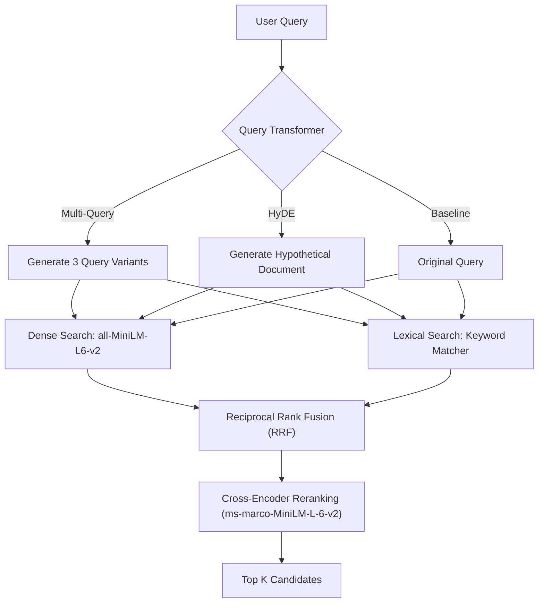

# 02. Retrieval Engineering

Retrieval is the foundation of any RAG system. Tokaroo implements a hybrid dense-lexical engine with query expansion and cross-encoder reranking to ensure high relevance and coverage.

---

## 1. What Problem?
Single-mode retrieval is prone to failure:
* **Dense Retrieval (Semantic)**: Captures conceptual similarity using embeddings but often misses exact, critical keyword matches (e.g., product IDs, names, or terminology).
* **Lexical Retrieval (Keyword)**: Captures exact phrase matches but fails when the user query uses synonyms or has grammatical variations.
* **Query Ambiguity**: Users write short, vague queries that do not align with corpus vocabulary.

---

## 2. What Metric?
* **Recall@K**: The percentage of ground-truth relevant chunks retrieved in the top K.
* **Mean Reciprocal Rank (MRR)**: Evaluates how high the first relevant chunk appears in the retrieved list.
* **Normalized Discounted Cumulative Gain (nDCG)**: Measures ranking quality, penalizing relevant chunks placed lower down.
* **Hit Rate**: The probability that at least one relevant chunk is retrieved.
* **Retrieval Overlap**: The ratio of duplicate chunks returned when merging results from multiple expanded queries.
* **Retrieval Diversity**: The cosine distance variation among retrieved chunks, indicating if the retriever is gathering redundant information.

---

## 3. How Implemented?



### Retrieval Options:
1. **Dense Retrieval**: Uses `SentenceTransformers` (`all-MiniLM-L6-v2`) to compute cosine similarities.
2. **Lexical Retrieval**: Uses token overlap and term frequencies to generate keyword similarity.
3. **Reciprocal Rank Fusion (RRF)**: Combines dense and lexical ranks using the formula:
   $$RRF(d) = \sum_{m \in M} \frac{1}{k + r_m(d)}$$
4. **Cross-Encoder Reranking**: Re-evaluates final fusion candidates using `ms-marco-MiniLM-L-6-v2` for precise relevance.
5. **HyDE**: LLM generates a hypothetical answer, which is then used as the dense query.
6. **MultiQuery**: LLM rewrites the query into multiple variants to search from different perspectives.

---

## 4. Example Input
```json
{
  "text": "Retrieval overlap occurs when semantically similar query rewrites retrieve the same chunks repeatedly. Lexical retrieval is fast but lacks conceptual understanding.",
  "query": "Why does retrieval overlap happen?",
  "chunk_size": 25,
  "overlap": 5,
  "top_k": 3,
  "retrieval_strategy": "rrf_fused",
  "query_transformer": "multi_query"
}
```

---

## 5. Example Output
```json
{
  "retrieval_mode": "rrf_fused",
  "query_strategy": "multi_query",
  "query_variants": [
    "Why does retrieval overlap happen?",
    "What causes duplicate chunks in expanded queries?",
    "Explain retrieval overlap causes"
  ],
  "total_retrieved_chunks": 6,
  "unique_retrieved_chunks": 4,
  "retrieval_overlap": 0.33,
  "retrieval_diversity": 0.76,
  "retrieval_metrics": {
    "recall_at_k": 1.0,
    "mrr": 1.0,
    "ndcg": 1.0
  }
}
```

---

## 6. Tradeoffs
* **Reranking Latency**: Introducing a cross-encoder model improves ranking precision dramatically but adds significant GPU/CPU latency per request.
* **Query Expansion Cost**: Using MultiQuery or HyDE increases recall rate but multiples database lookup loads and embedding generation costs.

---

## 7. Key Takeaways
1. **Better Retrieval ≠ Better Answers**: Achieving a Recall@K of 1.0 does not guarantee the LLM will generate a correct answer. Suboptimal context assembly can still cause failure.
2. **RRF Stabilizes Performance**: Hybrid search with Reciprocal Rank Fusion produces more consistent rankings across diverse queries than dense or keyword search alone.
