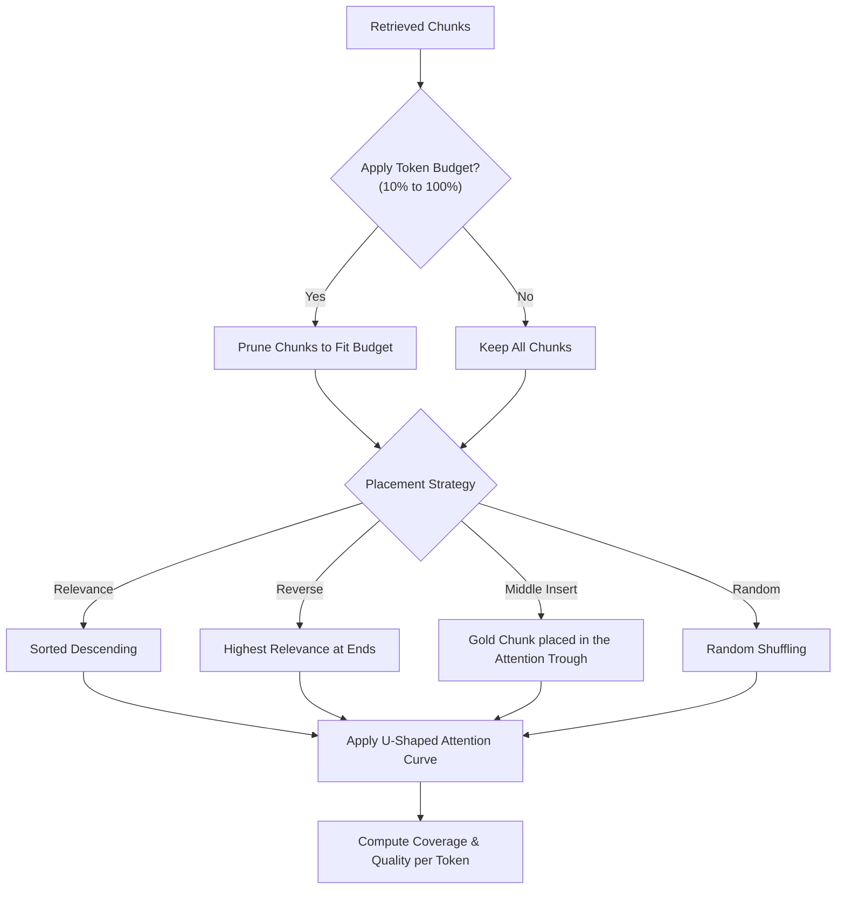

# 03. Context Engineering

Even when the necessary source information is retrieved, how that information is formatted, budgeted, and placed inside the LLM prompt context determines whether the model can retrieve and use it.

---

## 1. What Problem?
Modern LLMs have huge context windows (e.g., 128k to 1M tokens), leading developers to stuff prompts with all retrieved chunks. However, this causes severe issues:
* **Lost-in-the-Middle (Positional Bias)**: LLMs attend heavily to information at the very beginning and very end of a prompt, but frequently overlook tokens placed in the middle.
* **Token Budget Waste**: Supplying redundant or irrelevant text increases latency, increases API costs, and dilutes the model's focus.
* **Semantic Fragmentation**: Slicing related sentences across poor chunk boundaries destroys coherence.

---

## 2. What Metric?
* **Context Coverage (0.0 to 1.0)**: The fraction of gold/reference chunks successfully present in the prompt.
* **Attention Weight**: Deterministic score simulating how much attention the LLM pays to a chunk based on its prompt position.
* **Answer Quality**: The product of the gold chunk's positional attention weight and its relevance/similarity score.
* **Attention Waste**: The proportion of attention resources allocated to irrelevant or low-relevance chunks.
* **Quality per Token**: The ratio of the calculated answer quality to the total prompt context length.

---

## 3. How Implemented?



### Key Mechanisms:
1. **Positional Attention Simulation**: Emulates LLM retrieval performance across positions using a U-shaped attention weight decay curve:
   $$\text{Weight}(i) = 1.0 - \text{decay\_power} \times \left(\frac{|i - \text{center}|}{\text{length}}\right)^{\text{recency\_strength}}$$
2. **Context Placement Strategies**:
   * `relevance`: Chunks sorted by similarity descending.
   * `reverse`: Chunks sorted with highest similarity at the beginning and end, placing weaker chunks in the middle.
   * `middle_insert`: Forces the gold/target chunk into the exact center of the prompt to evaluate attention decay.
   * `random`: Distributes chunks randomly to establish a baseline.
3. **Token Budgeting**: Restricts the maximum number of tokens allowed for context (expressed as a percentage of retrieved tokens) to evaluate context-reduction trade-offs.

---

## 4. Example Input
```json
{
  "text": "The secret key is 'TOKAROO_V2'. Other text details filler info...",
  "query": "What is the secret key?",
  "gold_chunk_id": 1,
  "answer_chunk_position": "middle",
  "budget_percent": 35,
  "context_placement_strategy": "middle_insert"
}
```

---

## 5. Example Output
```json
{
  "chunks_in_prompt": 2,
  "budget_percent": 35,
  "budget_metrics": {
    "target_tokens": 150,
    "actual_tokens": 140
  },
  "answer_evaluation": {
    "gold_chunk_id": 1,
    "gold_chunk_in_prompt": true,
    "actual_position": 2,
    "gold_attention_weight": 0.125,
    "semantic_support": 0.950,
    "answer_quality": 0.119
  },
  "attention_waste": 0.88,
  "optimization": {
    "reorder_effect": {
      "before_health": 45,
      "after_health": 92,
      "reordering_recommended": true,
      "best_strategy": "reverse"
    }
  }
}
```

---

## 6. Tradeoffs
* **Pruning vs. Recall**: A smaller token budget (e.g., 35%) yields the highest *Quality per Token* and lowest latency, but risks dropping the target chunk entirely (Coverage falls to 0).
* **Positional Reordering Latency**: Sorting and rearranging chunks before injecting them into the prompt adds minimal CPU overhead but requires custom formatting pipelines.

---

## 7. Key Takeaways
1. **More Context ≠ Better Context**: Bloating the prompt to guarantee 100% coverage often causes the model to hallucinate or miss the answer entirely due to attention decay.
2. **Reverse Placement Mitigates Decay**: Positioning highly relevant chunks at the extreme ends (first and last positions) yields higher answer quality than standard descending sorting.
