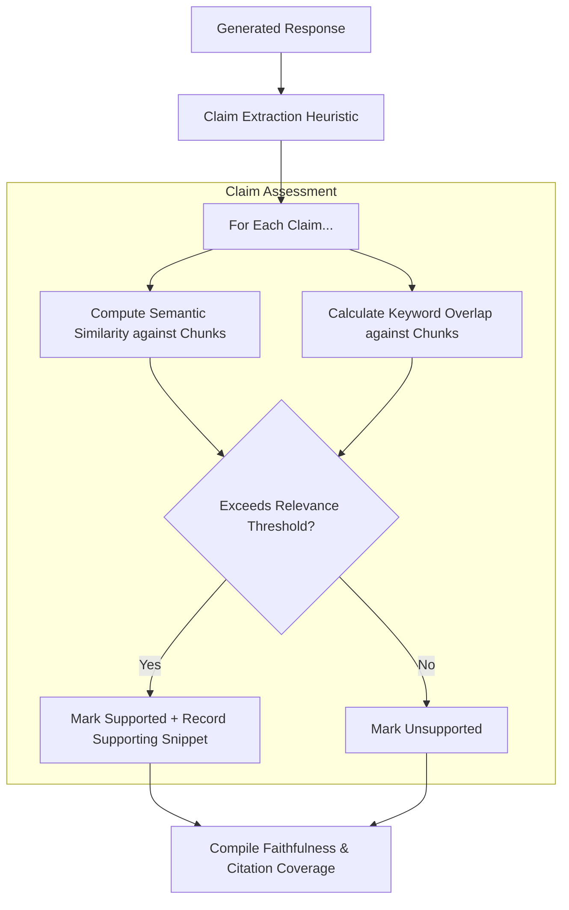

# 04. Generation Evaluation

Generation evaluation verifies whether the model-generated response is grounded, faithful to the source material, and free of hallucinations.

---

## 1. What Problem?
Retrieval evaluation metrics (Recall, MRR, nDCG) only measure the input side of the RAG pipeline. Even with perfect retrieval:
* **Hallucinations**: The LLM might generate claims that look highly convincing but are completely unsupported by the retrieved chunks.
* **Uncited Assertions**: The LLM might output correct statements but fail to reference the specific chunks they came from, making manual verification impossible.
* **Semantic Mismatch**: The LLM might generate an answer that matches vector similarity but drifts away from the actual query intent.

---

## 2. What Metric?
* **Faithfulness Score (0.0 to 1.0)**: The ratio of extracted claims that are fully supported by the retrieved context chunks.
* **Groundedness Score (0.0 to 1.0)**: Evaluates whether each statement can be semantically mapped to a specific sentence in the context with high confidence.
* **Evidence Similarity (`evidence_similarity`)**: The cosine similarity between the generated claim and its closest supporting context sentence.
* **Citation Coverage**: The ratio of claims containing explicit, valid source chunk citations (e.g. `[Chunk 1]`).

---

## 3. How Implemented?



### Assessment Engine:
1. **Response Modes**: Evaluates either synthetic outputs (heuristically constructed from matched chunks) or actual LLM-generated outputs.
2. **Claim Extraction**: Extracts individual sentences or independent assertions from the generated answer.
3. **Evidence Matching**: Scans all retrieved chunks to find the maximum semantic overlap (`evidence_similarity`) and lexical overlap for each claim.
4. **Citation Check**: Verifies if claims referencing specific indexes correlate with the actual supporting chunk IDs.

---

## 4. Example Input
```json
{
  "gold_answer": "AdityaP700 built Tokaroo in 2026. He lives in Seattle.",
  "text": "Tokaroo was created by AdityaP700 in June 2026 as a RAG debugging platform.",
  "generation_mode": "synthetic"
}
```

---

## 5. Example Output
```json
{
  "faithfulness": {
    "score": 0.5,
    "supported_claims": 1,
    "unsupported_claims": 1,
    "claims": [
      {
        "claim": "AdityaP700 built Tokaroo in 2026.",
        "supported": true,
        "max_similarity": 0.92,
        "supporting_chunk_index": 0,
        "supporting_snippet": "Tokaroo was created by AdityaP700 in June 2026..."
      },
      {
        "claim": "He lives in Seattle.",
        "supported": false,
        "max_similarity": 0.15,
        "supporting_chunk_index": null,
        "supporting_snippet": null
      }
    ]
  },
  "citation_coverage": {
    "coverage_score": 0.5,
    "claims_with_citations": 1,
    "total_claims": 2
  }
}
```

---

## 6. Tradeoffs
* **Evaluation Speed vs. Rigor**: LLM-as-a-judge evaluation (using prompt-based reasoning to determine support) is highly accurate but expensive and slow. Tokaroo's deterministic semantic overlap matching is fast and local, but may occasionally misinterpret logical negations (e.g. "is not" matching "is").
* **Granularity**: Sentence-level claim extraction is simple to run, but can miss sub-sentence clauses or compound statements.

---

## 7. Key Takeaways
1. **An Answer Can Look Convincing While Being Fabricated**: Syntactically fluent responses often disguise a lack of factual grounding. Evaluating generation quality is mandatory.
2. **Faithfulness and Retrieval Quality Measure Different Things**: Perfect retrieval (Recall@K = 1.0) does not prevent generation failure. Similarly, a faithful answer can still fail to answer the user's actual question if retrieval missed the correct context.
