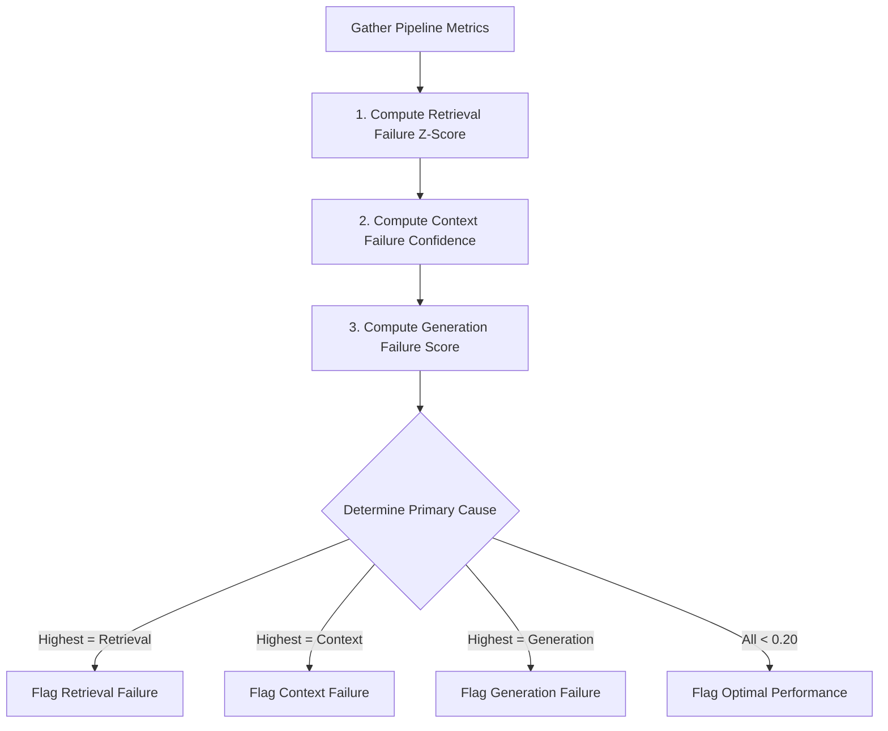

# 05. RAG Observability & Diagnostics

Observability links retrieval metrics, prompt context structures, and generation output to diagnose and pinpoint precisely why a RAG pipeline fails.

---

## 1. What Problem?
When a RAG system fails, standard monitoring tools merely report a bad output. They treat the RAG pipeline as a single black box, leaving developers to guess:
* Did the vector database fail to find relevant documents?
* Did prompt formatting truncate or hide the relevant documents (e.g., lost-in-the-middle)?
* Did the LLM choose to ignore the provided documents?

Tokaroo decomposes these failures, calculating relative confidence scores to isolate the primary bottleneck.

---

## 2. What Metric?
* **Retrieval Failure Confidence**: Likelihood that the vector search phase failed to find relevant data (computed using the Z-score of the top similarity match relative to the corpus baseline).
* **Context Failure Confidence**: Likelihood that retrieved information was dropped due to token limits or ignored due to positional decay.
* **Generation Failure Confidence**: Likelihood that the model output is ungrounded or contradicts the provided context.
* **Primary Cause**: Categorical classification based on the highest confidence score (`retrieval_failure`, `context_failure`, `generation_failure`, or `none`).

---

## 3. How Implemented?



### The Causal Diagnostics Engine:
1. **Retrieval Assessment (Z-Score)**:
   Instead of using raw similarity scores, Tokaroo evaluates the relative signal-to-noise ratio. It calculates the mean and standard deviation of all chunk scores. A low Z-score indicates the top hit is not statistically distinct from the rest of the corpus, pointing to retrieval failure:
   $$Z = \frac{\text{Max Relevance} - \text{Mean}}{\text{Std Dev}}$$
2. **Context Assessment**:
   Calculates the ratio of dropped relevant chunks (retrieved but excluded due to token budgeting) and ignored relevant chunks (retained but placed in the low-attention middle zone).
3. **Generation Assessment**:
   Derived directly from the proportion of unsupported claims in the response:
   $$\text{Gen Failure} = 1.0 - \text{Faithfulness Score}$$
4. **Diagnostic Attribution**:
   Compares all three confidence scores. Whichever has the highest value (above a threshold of 0.20) is flagged as the `primary_cause`.

---

## 4. Example Input
A simulation run where the target chunk is retrieved but placed in the low-attention middle zone, and the model subsequently generates an incorrect response.

---

## 5. Example Output
```json
{
  "root_cause": {
    "retrieval_failure_confidence": 0.077,
    "context_failure_confidence": 0.615,
    "generation_failure_confidence": 0.500,
    "primary_cause": "context_failure",
    "root_cause_reason": "Relevant chunks were placed in the prompt but ignored due to low attention weights / positional decay (1 ignored).",
    "evidence": {
      "dropped_relevant_chunks": 0,
      "ignored_chunks": 1,
      "usage_gap": 0.450,
      "max_relevance": 0.850,
      "global_relevance_thresh": 0.680
    }
  }
}
```

---

## 6. Tradeoffs
* **Attribution Overlap**: A RAG failure can sometimes span multiple layers (e.g., poor retrieval combined with a weak model). Deciding a single `primary_cause` simplifies debugging but can occasionally hide secondary issues.
* **Heuristic Thresholds**: Setting the minimum failure threshold at `0.20` requires tuning depending on the specific models and corpus domain.

---

## 7. Key Takeaways
1. **Faithfulness Alone is Not Enough**: A RAG response can be 100% faithful to the context (no hallucinations) but still be wrong because the retriever failed to find the correct document.
2. **Observability Requires Correlation**: Diagnostic confidence is only reliable when it correlates retrieval similarity, context placement decay, and generation grounding.
