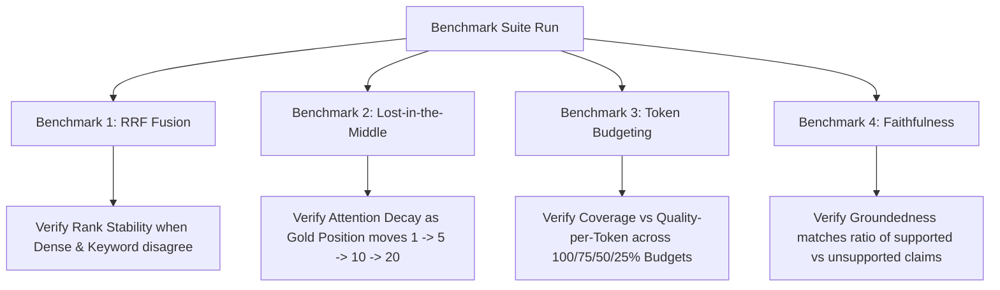

# 06. Benchmark Suite

RAG evaluation systems must themselves be tested and validated against controlled, deterministic failure cases to ensure their diagnostic outputs are reliable.

---

## 1. What Problem?
How do you know if your evaluation framework is working correctly? If you cannot verify that your evaluator detects failures, you cannot trust its scores in production.

To prevent "evaluating the evaluator" from becoming circular, Tokaroo implements a dedicated benchmark suite that forces specific, predictable failure modes and verifies that the metrics reflect these failures.

---

## 2. What Metric?
* **Metric Sensitivity**: The ability of the diagnostic engine to correctly identify forced failure modes (e.g., Z-score drop under RRF failure, or health score decay under Lost-in-the-Middle).
* **Rank Stability**: Reciprocal Rank Fusion (RRF) rank changes compared to standalone dense or lexical retrievals.
* **Pruning Precision**: Evaluates the tradeoff between coverage and Quality per Token across budget steps.

---

## 3. How Implemented?
The benchmark suite is defined in a static JSON fixture: `backend/tests/fixtures/benchmark_suite.json`. Tokaroo runs these test cases using `pytest` to validate the metrics engine against four core scenarios:



### The 4 Scenarios:
1. **Benchmark 1 (RRF & Fusion)**:
   Forces a disagreement where dense retrieval succeeds (high semantic similarity) but keyword retrieval fails (zero token overlap). Validates that RRF produces a balanced, stable rank.
2. **Benchmark 2 (Lost-in-the-Middle)**:
   Forces the target chunk into positions `1`, `5`, `10`, and `20` in the prompt context. Validates that the attention curve weight decays in the middle positions, dropping the overall health score.
3. **Benchmark 3 (Token Budget)**:
   Tests context pruning across four budget limits: `100%`, `75%`, `50%`, and `25%`. Validates that as the budget shrinks, *Quality per Token* rises while *Coverage* eventually drops.
4. **Benchmark 4 (Faithfulness)**:
   Generates a mock answer containing one fully supported claim and one completely unsupported claim. Validates that the faithfulness engine scores the response at exactly `0.5` and correctly extracts the unsupported statement.

---

## 4. Example Input
To execute the benchmark suite, run the following command from the `backend` directory:
```bash
pytest tests/test_app.py -k benchmark_suite
```

---

## 5. Example Output
```bash
$ pytest tests/test_app.py -k benchmark_suite
========================= test session starts =========================
platform win32 -- Python 3.11.4, pytest-7.4.0
collected 4 items

tests/test_app.py ....                                          [100%]

========================== 4 passed in 2.14s ==========================
```

---

## 6. Tradeoffs
* **Static Fixtures vs. Dynamic Shift**: Using static JSON cases ensures reproducible, deterministic unit tests, but does not capture domain-specific data changes or real-world prompt drift.
* **Deterministic Simulators**: The benchmark suite tests the logic of the simulators, but because it avoids calling expensive LLMs directly in unit tests, it cannot verify third-party model API drift.

---

## 7. Key Takeaways
1. **Evaluation Metrics Must Be Tested**: A metric that cannot be validated against forced failure scenarios is untrustworthy.
2. **Controlled Disagreement is Critical**: Testing retrievers with contrasting semantic/lexical inputs is the only way to measure fusion and rerank stability under adversarial conditions.
